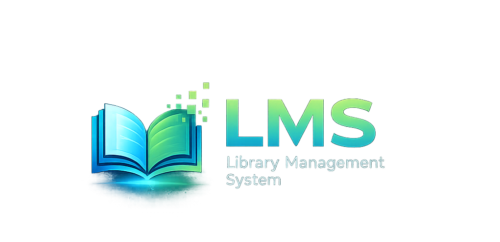

  

<h1 align="center">Library Management System</h1>

  Web-based LMS built using PHP, MySQL, Bootstrap and XAMPP

## Features
- User Authentication
- Book Management
- Book Category Management
- Library Member Registration
- Borrow Management
- Fine Management
- CRUD Operations
- Input Validations using Regex
- Session Handling
- GitHub Version Control

## Technologies Used
- PHP
- MySQL
- HTML5
- CSS3
- Bootstrap 5
- XAMPP
- Git & GitHub
